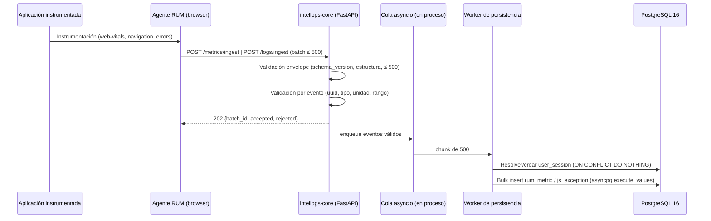

# Pipeline de Ingesta RUM

- **Versión**: 1.0
- **Fecha**: 2026-09-05
- **Issue**: ISS-S1-06
- **Owner**: Federico
- **Dependencia**: ISS-S1-05 (Contrato de ingesta RUM)
- **Estado**: Aprobado para implementación

## 1. Flujo de ingesta



## 2. Estrategia de validación y manejo de eventos inválidos

### 2.1. Niveles de validación

| Nivel | Qué valida | Falla → |
|-------|-----------|---------|
| Envelope | `schema_version`, estructura de batch, `events ≤ 500` | **400** — se rechaza el batch completo |
| Evento | UUIDs, tipo de métrica, unidad, rango de cordura, campos requeridos, `application_id` conocido | **202 parcial** — se rechaza solo el evento |

### 2.2. Respuesta del batch (202)

```json
{
  "batch_id": "3f2a0f6e-9f1e-4b6e-8c2a-1a2b3c4d5e6f",
  "accepted": 497,
  "rejected": [
    { "index": 12, "reason": "unknown_metric_type" },
    { "index": 13, "reason": "invalid_range" }
  ]
}
```

- `batch_id` lo genera el servidor por batch recibido; sirve para correlacionar el envío con logs y retries del agente. **No se persiste en la BD en S1.**
- `index` es la posición del evento dentro del array `events` del batch enviado.

### 2.3. Códigos de rechazo por evento

| Reason | Significado |
|--------|-------------|
| `missing_required_field` | Falta un campo obligatorio del evento |
| `invalid_uuid` | `session_id` / `application_id` / `metric_id` no son UUID válidos |
| `invalid_metric_type` | `type` fuera del enum (TTFB, FCP, XHR_LATENCY, JS_EXCEPTION_RATE, RAGE_CLICK) |
| `invalid_unit` | `unit` fuera de `ms`/`count` o incoherente con el tipo |
| `invalid_range` | `value` fuera del rango de cordura (ej. TTFB > 60000) |
| `invalid_timestamp` | `timestamp` no parseable o fuera de ventana aceptable |
| `unknown_application` | `application_id` no existe en `APPLICATION` (no se puede crear la sesión) |
| `oversized_event` | Excede límites de longitud (ej. `stack_trace` > 20000) |

### 2.4. Manejo de eventos rechazados

- **Nunca se persisten.** Se registran en log estructurado (batch_id + index + reason) y en contadores Prometheus (`ingest.rejected_total{reason}`).
- El agente decide si reintenta; en S1 no hay retry automático del lado del servidor.

## 3. Estrategia de persistencia asíncrona (bulk insert)

Para S1 se adopta una **cola en proceso (`asyncio.Queue`) acotada**, priorizando simplicidad operacional, bajo consumo de recursos y backpressure sin incorporar infraestructura adicional. La cola no ofrece durabilidad ante reinicios del proceso; esta limitación es **aceptada explícitamente en S1**. La interfaz de cola se abstrae para permitir migración futura a un broker durable.

### 3.1. Configuración propuesta

| Parámetro | Valor | Notas |
|-----------|-------|-------|
| Cola | `asyncio.Queue(maxsize=10000)` | Configurable; se crea en el lifespan de FastAPI |
| Workers | 2 | Consumen de la cola y persisten |
| Chunk de inserción | 500 filas | `asyncpg.execute_values`, una transacción por chunk |
| Pool | `pool_size=20, max_overflow=10` | Definido en ISS-S1-04 |
| Retry | 3 intentos, backoff exponencial (0.5s, 1s, 2s) | Solo errores transitorios de DB |
| Dead-letter | Log + contador `ingest.persistence_dead_letter_total` | Errores permanentes; tabla física queda como extensión |

### 3.2. Secuencia de persistencia por chunk

1. **Resolver sesión**: `INSERT INTO user_session (session_id, app_id, start_timestamp, user_agent) VALUES (...) ON CONFLICT (session_id) DO NOTHING` — `app_id` sale del `application_id` del evento; `user_agent` del metadata si viene.
2. **Bulk insert `rum_metric`**: filas desde `RumEvent.metrics[]` (type → `metric_type_id` resuelto contra el catálogo).
3. **Bulk insert `js_exception`**: filas desde `JsExceptionEvent` (`metric_id` se persiste si viene y existe; si viene y no existe → NULL + contador `ingest.metric_id_unknown_total`, es correlación blanda).

### 3.3. Backpressure

- Cola llena → **503 Service Unavailable** (el agente debe reintentar con backoff).
- 429 sigue siendo rate limit por API key.

### 3.4. Semántica del 202

El 202 se devuelve al **encolar** los eventos válidos, no al persistir. Si el worker agota retries, los eventos van a dead-letter (visibles en logs/contadores), nunca silenciosamente.

## 4. Observabilidad

| Métrica | Tipo | Propósito |
|---------|------|-----------|
| `ingest.received_total` | Counter | Eventos recibidos |
| `ingest.accepted_total` | Counter | Eventos aceptados a cola |
| `ingest.rejected_total{reason}` | Counter | Eventos rechazados por motivo |
| `ingest.persisted_total` | Counter | Filas insertadas |
| `ingest.persistence_dead_letter_total` | Counter | Chunks que agotaron retries |
| `ingest.queue_depth` | Gauge | Ocupación de la cola |
| `ingest.request_duration_seconds` | Histogram | Latencia del endpoint |

## 5. Límites aceptados en S1 (explícitos)

- Cola en proceso sin durabilidad ante reinicios (pérdida posible de eventos en cola).
- `batch_id` no persistido (sin trazabilidad en BD; correlación por logs).
- Sin retry automático del agente ni idempotencia por `batch_id` enviado por el cliente.
- Sin tabla física de dead-letter.

## 6. Extensiones futuras (S2+)

- Broker durable (Redis/AMQP) detrás de la interfaz de cola.
- Persistir `batch_id` y dedup/idempotencia.
- Dead-letter table + replay.
- Retry del agente con backoff.