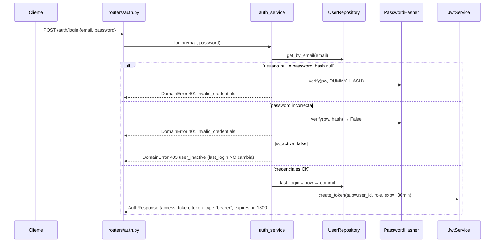

# DESIGN — ISS-S2-01: Backend Core funcional

**Base**: proposal `sdd/ISS-S2-01/proposal`, spec `sdd/ISS-S2-01/spec`, explore `sdd/ISS-S2-01/explore`, código real en `feat/ISS-S2-01` (develop con PR #46 mergeado). **Modo**: engram. **Idioma**: español neutro técnico.

## 1. Enfoque técnico

Monolito modular FastAPI siguiendo el scaffolding existente (capas vacías `domain/*`, `presentation/*`, `infrastructure/db` ya funcional con engine async + `get_session`): **presentation (routers + schemas Pydantic + dependencies) → services (casos de uso) → repositories (Protocol + SQLAlchemy async) → PostgreSQL 16 canónico**. JWT HS256 access-only (PyJWT), passwords argon2 (pwdlib), API key SHA-256 con prefijo `ilp_` como utilidades dormidas (schema en 0002, uso en S2-02). Migración 0002 escrita a mano (consistente con 0001 y `env.py target_metadata=None`), sync de `ddl_v1.0.sql` (decisión usuario, DATA-5). Strict TDD con Postgres real y fixtures async (nuevo dev-dep `pytest-asyncio`).

### C4 contexto

```
[Admin/Researcher (UI/CLI)] ──HTTPS──▶ [IntellOps API (FastAPI, monolito modular)] ──SQL──▶ [PostgreSQL 16]
                                             │
                     presentation (routers/schemas/deps) → services → repositories → infrastructure/db
                                             │
                     infrastructure/security (password|jwt|api_keys) — sin estado, sin servicios nuevos
```

### Flujo de datos — login (Mermaid)



## 2. Decisiones de arquitectura (ADR)

| # | Decisión | Opciones | Tradeoff | Decisión |
|---|----------|----------|----------|----------|
| 01 | Token | Solo access 30 min vs access+refresh | Refresh mejora UX pero exige rotación/revocación/storage | **Access-only HS256 30 min; refresh → S4** (spec AUTH-1) |
| 02 | Hash passwords | pwdlib[argon2] vs passlib[bcrypt] | passlib desactualizado (sin mantenimiento); argon2 recomendado por FastAPI | **pwdlib[argon2]** (`PasswordHash.recommended()`) |
| 03 | Hash API key | SHA-256 hex vs argon2/bcrypt | Key aleatoria de alta entropía: KDF no agrega seguridad y penaliza hot path de ingesta | **SHA-256 hex + prefijo `ilp_`**, utilidades dormidas en S2-01 |
| 04 | Política de roles | Admin-only mutaciones vs ambos | Menor superficie de ataque; Researcher es rol de lectura/investigación | **Admin muta / Researcher lee** (`require_role`) |
| 05 | Bootstrap Admin | Seed en 0002 vs script make vs first-user-wins | Seed = login inmediato dev/CI; script agrega paso manual; first-user-wins complica auth | **Seed en 0002**: UUID fijo, email `admin@intellops.local`, hash argon2 precomputado de password dev documentada en `.env.example`/README |
| 06 | password_hash DDL | NULL + enforcement vs NOT NULL | NOT NULL rompe upgrades sobre filas 0001 existentes | **NULL en DDL, enforcement en servicio** (sin hash → 401) |
| 07 | DELETE application | Hard delete 409 vs soft delete | Soft delete difiere a S2-02 (is_active ya previsto en 0003) | **Hard delete + 409** ante FK RESTRICT de `user_session.app_id` |
| 08 | ddl_v1.0.sql | Sync con 0002 vs divergencia documentada | Header de 0001 condiciona su modificación a migración nueva (condición cumplida); preserva DDL como fuente de verdad | **Sync**: columnas, índices y seed agregados; 0001 intacto |
| 09 | Errores | DomainError tipificados + handlers vs HTTPException en routers | Errores tipificados dan contrato estable 401/403/404/409 y rollback centralizado | **`domain/exceptions.py`**: `AuthenticationError(401)`, `AuthorizationError(403)`, `NotFoundError(404)`, `ConflictError(409)` → handlers en `main.py` → `ErrorResponse {error:{code,message}}` (schema ya existente) |
| 10 | Transacciones | Servicios dueños del commit vs repos auto-commit | Repos sin estado de transacción; servicio coordina y hace rollback en error | **Servicios llaman `session.commit()`; ante DomainError → `session.rollback()` antes de re-lanzar** |
| 11 | Tests async | pytest-asyncio (asyncio_mode=auto) vs TestClient sync | Fixtures async (httpx AsyncClient + override de get_session) necesitan runner async | **Agregar `pytest-asyncio` a dev extras + requirements.txt**; `test_health.py` no se toca |
| 12 | EmailStr | Pydantic EmailStr vs regex manual | EmailStr requiere `email-validator` | **Agregar `email-validator`** a runtime deps; 422 automático (USR-7) |
| 13 | Anti-enumeración | Dummy verify vs early return | Early return permite timing-attack de enumeración | **`verify(pw, DUMMY_HASH)` cuando usuario no existe o hash NULL** → 401 idéntico (SEC-1) |
| 14 | Rol inexistente | `get_role_by_id` en UserRepository vs RoleRepository aparte | Un método en el repo de user evita un repo/catálogo nuevo para una validación puntual (USR-4) | **`UserRepository.get_role_by_id(role_id)`** → None → ConflictError 409 |
| 15 | Token de usuario inactivo | 401 vs 403 | Coherencia con login (SEC-2) | **403 `AuthorizationError`** (fuerza re-login) |
| 16 | api_token_hash en respuestas | Exponer null vs omitir | Spec APP-2 exige `api_token_hash: null` en 201; SEC-4 prohíbe exponer hashes reales | **S2-01: campo presente, siempre null** (columna dormida); S2-02 lo retira de respuestas al activar hashes reales |

## 3. Estructura de módulos/archivos

| Archivo | Acción | Descripción |
|---------|--------|-------------|
| `src/api/config.py` | Modificar | Settings: `jwt_secret` (validator min 32 chars), `jwt_algorithm="HS256"`, `jwt_access_token_expire_minutes=30`, `api_key_prefix="ilp_"` |
| `src/api/main.py` | Modificar | `include_router` auth/users/applications; handlers de DomainError; /health y /ready intactos |
| `pyproject.toml`, `src/api/requirements.txt` | Modificar | + `PyJWT>=2.9`, `pwdlib[argon2]`, `email-validator`, dev `pytest-asyncio` |
| `.env.example` | Modificar | + `JWT_SECRET` (placeholder dev ≥32 chars), `ADMIN_BOOTSTRAP_PASSWORD` (password dev del seed) |
| `src/api/domain/exceptions.py` | Nuevo | `DomainError` + 4 subtipos tipificados (ADR-09) |
| `src/api/domain/entities/base.py` | Nuevo | `Base(DeclarativeBase)` |
| `src/api/domain/entities/{user_role,lab_user,application}.py` | Nuevo | Modelos SQLAlchemy 2.0 typed (convención del repo: entidad por módulo) |
| `src/api/domain/repositories/{user_repository,application_repository}.py` | Nuevo | Protocols |
| `src/api/domain/services/{auth_service,user_service,application_service}.py` | Nuevo | Casos de uso |
| `src/api/infrastructure/security/{__init__,password,jwt,api_keys}.py` | Nuevo | hash/verify argon2; create/decode JWT; utilidades API key dormidas |
| `src/api/infrastructure/db/repositories/{sqlalchemy_user_repository,sqlalchemy_application_repository}.py` | Nuevo | Implementaciones async |
| `src/api/infrastructure/db/migrations/versions/0002_credentials.py` | Nuevo | Migración (ver §5) |
| `src/api/presentation/dependencies.py` | Nuevo | `get_current_user`, `require_role` |
| `src/api/presentation/schemas/{auth,user,application}.py` | Nuevo | Pydantic |
| `src/api/presentation/routers/{auth,users,applications}.py` | Nuevo | Endpoints |
| `openspec/specs/database/ddl_v1.0.sql` | Modificar | Sync 0002 (ver §5) |
| `openspec/specs/openapi.yaml` | Modificar | +6 paths, bearerAuth, schemas (ver §6) |
| `tests/conftest.py` | Nuevo | Fixtures async + aislamiento |
| `tests/{test_auth,test_users,test_applications,test_migrations,test_security}.py` | Nuevo | Suites TDD |

## 4. Diseño por capa

### 4.1 infrastructure/security

- **password.py**: `class PasswordHasher` sobre `pwdlib.PasswordHash.recommended()`: `hash_password(plain) -> str` (argon2id, salt aleatorio), `verify_password(plain, hashed) -> bool`. Expone `DUMMY_HASH` (hash argon2 de una password fija) para igualar timing (ADR-13).
- **jwt.py**: `create_access_token(user_id: UUID, role: str, *, secret, algorithm, expire_minutes) -> str` con claims `sub=str(user_id)`, `role`, `iat`, `exp` (iat+30min), `iss="intellops-api"`; `decode_token(token, secret) -> dict` levantando `jwt.InvalidTokenError` (cubre expirado y firma inválida). PyJWT HS256.
- **api_keys.py** (dormido, sin wiring): `generate_api_key() -> "ilp_" + base64url(32 bytes)`, `hash_api_key(key) -> sha256 hex (64 chars)`. Unit tests de formato; sin uso en endpoints (proposal: uso en S2-02).
- **Errores**: los módulos levantan `DomainError`; nunca exponen hashes.

### 4.2 Modelos ORM (domain/entities, SQLAlchemy 2.0 typed — `Mapped`/`mapped_column`)

- `UserRole`: `role_id SMALLINT` PK (identity), `name VARCHAR(30)` unique, `description`, `is_active` — catálogo ya seedado por 0001 (Admin=1, Researcher=2 vía identity; mapeo por nombre, no por id).
- `LabUser`: `user_id UUID` PK (default `uuid4` en Python, consistente con DDL sin default), `name TEXT`, `email TEXT` (único vía `idx_lab_user_email` de 0002), `password_hash VARCHAR(255)` nullable, `role_id SMALLINT` FK→`user_role` RESTRICT, `is_active BOOL` default true, `last_login TIMESTAMPTZ` nullable, `created_at` server_default `CURRENT_TIMESTAMP`; relationship `role: UserRole`.
- `Application`: `app_id UUID` PK, `name TEXT`, `description TEXT` nullable, `api_token_hash VARCHAR(64)` nullable (dormida), `created_at` server_default; índice único parcial `idx_application_api_token_hash WHERE api_token_hash IS NOT NULL` (declarado vía `Index(..., unique=True, postgresql_where=...)`).
- `Base` en `domain/entities/base.py`; NO se usa `target_metadata` en Alembic (env.py `target_metadata=None` — migraciones a mano).

### 4.3 Repositorios (Protocol en domain, impl SQLAlchemy en infrastructure/db/repositories)

`UserRepository` (Protocol): `get_by_id(user_id) -> LabUser|None`, `get_by_email(email) -> LabUser|None`, `list() -> list[LabUser]`, `create(user) -> LabUser`, `update(user) -> None`, `get_role_by_id(role_id) -> UserRole|None` (ADR-14). `ApplicationRepository`: `get_by_id(app_id) -> Application|None`, `list() -> list[Application]`, `create(app)`, `update(app)`, `delete(app_id)`, `get_by_api_token_hash(hash) -> Application|None` (dormido, contrato de explore para S2-02). Implementaciones async reciben `AsyncSession`; mutaciones NO commitean (ADR-10); `IntegrityError` (UNIQUE email, FK role, FK RESTRICT de delete) se traduce a `ConflictError` en la impl o en el servicio.

### 4.4 Servicios (casos de uso)

- **auth_service**: `login(email, password) -> AuthResponse` (get_by_email → verify con dummy si falta → 401 idéntico; is_active=false → 403 sin tocar last_login; OK → last_login=now + commit + token con role denormalizado); `logout() -> None` (contrato stateless: sin estado en servidor, el router responde 204). **El seed NO vive en el servicio**: es SQL de la migración 0002 (DATA-3).
- **user_service**: `list_users()`, `get_user(user_id)` (404), `create_user(data)` (rol existe → 409 si no; hash argon2; IntegrityError email → 409; commit), `update_user(user_id, data)` (404; re-hash solo si `password` enviado; email duplicado → 409; commit). `password_hash` jamás sale del servicio (schemas sin ese campo, SEC-4).
- **application_service**: `list_applications()`, `get_application(app_id)` (404), `create_application(data)` (name no vacío vía schema 422; `api_token_hash=None`), `update_application(app_id, data)` (404), `delete_application(app_id)` (404 si no existe; FK RESTRICT → 409 y rollback; OK → 204).

### 4.5 Presentation (routers + schemas + dependencies)

- **schemas**: `auth.py`: `LoginRequest{email: EmailStr, password: str}`, `AuthResponse{access_token, token_type: Literal["bearer"], expires_in: int}`. `user.py`: `UserCreate{name, email: EmailStr, password: str(min_length=8), role_id: int}`, `UserUpdate{name?, email? (EmailStr), password? (min_length=8), is_active?, role_id?}`, `UserRead{user_id, name, email, role_id, is_active, last_login, created_at}` (sin password_hash). `application.py`: `ApplicationCreate{name: str(min_length=1), description?}`, `ApplicationUpdate{name?, description?}`, `ApplicationRead{app_id, name, description, api_token_hash: None (ADR-16), created_at}`.
- **dependencies.py**: `get_current_user(credentials: HTTPBearer(auto_error=False), session)` → decode (inválido/expirado → 401 `invalid_token`), `get_by_id` (inexistente → 401), `is_active=false` → 403 (ADR-15); `require_role(*roles)` → factory que valida `current_user.role.name` → 403 `forbidden`. `get_session` reutiliza `infrastructure/db/session.py` (existente).
- **routers**: `auth.py` (`POST /auth/login` público, `POST /auth/logout` bearer → 204); `users.py` (`GET /users` Admin+Researcher, `POST /users` Admin 201, `GET/PUT /users/{user_id}` Admin PUT); `applications.py` (`GET/POST`, `GET/PUT/DELETE /applications/{application_id}`; DELETE → 204 | 404 | 409). `response_model` de solo lectura; `status_code=201/204`.
- **main.py**: `app.include_router` ×3 (tags Auth/Users/Applications); `add_exception_handler(DomainError)` → `JSONResponse(ErrorResponse)`; /health, /ready, CORS intactos.

## 5. Migración 0002 + sync ddl_v1.0.sql

`0002_credentials.py`: `revision="0002"`, `down_revision="0001"`, escrita a mano, NO toca 0001.

**upgrade()**: (1) `ALTER TABLE lab_user ADD COLUMN password_hash VARCHAR(255)` (NULL, ADR-06); (2) `CREATE UNIQUE INDEX idx_lab_user_email ON lab_user(email)`; (3) `ALTER TABLE application ADD COLUMN api_token_hash VARCHAR(64)`; (4) `CREATE UNIQUE INDEX idx_application_api_token_hash ON application(api_token_hash) WHERE api_token_hash IS NOT NULL`; (5) seed: `INSERT INTO lab_user (user_id, name, email, role_id, is_active, password_hash) VALUES ('<UUID fijo: 9f8c5a2e-1b2c-4d5e-8f9a-0b1c2d3e4f5a>', 'Admin', 'admin@intellops.local', (SELECT role_id FROM user_role WHERE name='Admin'), TRUE, '<hash argon2 precomputado del password dev>')` — hash fijo precomputado (el salt va embebido en la cadena argon2, verify funciona); password dev documentada en `.env.example` (`ADMIN_BOOTSTRAP_PASSWORD`) y README.

**downgrade()** (orden DATA-4): (1) `DELETE FROM lab_user WHERE user_id='<UUID fijo>'` (seguro: user_favorite_metric CASCADE, user_session SET NULL); (2) `DROP INDEX idx_application_api_token_hash`; (3) `ALTER TABLE application DROP COLUMN api_token_hash`; (4) `DROP INDEX idx_lab_user_email`; (5) `ALTER TABLE lab_user DROP COLUMN password_hash`.

**ddl_v1.0.sql** (DATA-5): agregar `password_hash VARCHAR(255)` a `lab_user` + `CREATE UNIQUE INDEX idx_lab_user_email`; `api_token_hash VARCHAR(64)` a `application` + índice único parcial; INSERT del seed Admin (mismo UUID fijo y hash) con comentario "solo dev/CI". 0001 no se modifica.

## 6. OpenAPI (openspec/specs/openapi.yaml)

- `securitySchemes.bearerAuth: {type: http, scheme: bearer, bearerFormat: JWT}` (nuevo); `apiKey` queda declarado sin aplicar (OAS-3).
- 6 paths nuevos (11 ops): `/auth/login` (post, público), `/auth/logout` (post, `security: [bearerAuth]`), `/users` (get/post), `/users/{user_id}` (get/put), `/applications` (get/post), `/applications/{application_id}` (get/put/delete) — con `security: [bearerAuth]`.
- Schemas: `LoginRequest`, `AuthResponse`, `UserCreate`, `UserUpdate`, `UserRead`, `ApplicationCreate`, `ApplicationUpdate`, `ApplicationRead`; reutilizar `ErrorResponse` (ya existe, `{error:{code,message}}`) en 401/403/404/409; 422 default de FastAPI.
- Paths existentes (/health, /ready, ingesta, telemetría) intactos (OAS-4).

## 7. Estrategia de tests (strict TDD, Postgres real)

- **conftest.py**: `pytest-asyncio` (asyncio_mode=auto); `db_session` session-scoped: engine async (reusa `get_engine()`), `alembic upgrade head` vía API de Alembic; `clean_db` (por test): `TRUNCATE rum_metric, js_exception, anomaly, alert, ml_model, user_session, user_favorite_metric, lab_user, application RESTART IDENTITY CASCADE` — catálogos (user_role, metric_type, …) NO se truncan; `seed_admin` re-inserta el seed (mismo INSERT que 0002) para los escenarios que lo requieren; `client`: `httpx.AsyncClient(transport=ASGITransport(app))` con `app.dependency_overrides[get_session]`; helpers `make_admin()`/`make_researcher()` (crean vía servicio y loguean → token).
- **test_security.py** (unit): roundtrip hash/verify argon2; verify falso; jwt claims (sub, role, iss, iat/exp = iat+30min); expirado/firma inválida → error; api key formato `ilp_`+43 base64url y sha256 hex 64.
- **test_auth.py**: escenarios AUTH-1..AUTH-6 (login OK + claims + last_login; 401 indistinguible email desconocido/password/without hash; 403 inactivo sin last_login; logout 204; token inválido/expirado → 401; jwt_secret <32 → error de settings).
- **test_users.py**: USR-1..USR-7 (list sin hashes; create Admin 201 + argon2 verifica + is_active; email duplicado 409; role inexistente 409; Researcher 403; PUT sin password conserva hash; PUT con password re-hashea; GET 404; 422 de forma).
- **test_applications.py**: APP-1..APP-6 (create 201 con api_token_hash null; list/detail 200; detail 404; Researcher 403; delete sin sesiones 204 y GET→404; delete con sesiones 409 y GET→200; PUT 404; name vacío 422).
- **test_migrations.py**: columnas/índices/seed presentes tras upgrade head (information_schema + query); `downgrade 0001` elimina todo y `upgrade head` restaura (test autocontenido que restaura estado).
- Cobertura ≥70% (CI ya mide `pytest --cov=src --cov-fail-under=70`); `test_health.py` intacto. TDD: cada escenario Given/When/Then de la spec → test RED antes de implementar (config.yaml `tdd: true`).

## 8. Threat Matrix

N/A — el cambio agrega routing HTTP de aplicación (FastAPI routers) y migraciones de DB, pero NO introduce shell commands, subprocesses, VCS/PR automation, clasificación de ejecutables ni integración de procesos. Filas evaluadas: documentation-like paths (N/A: sin archivos ejecutables nuevos), git selection (N/A), commit state (N/A), push state (N/A), PR commands (N/A: los PRs se crean con herramientas del orquestador, no del código del cambio).

## 9. Migración/Rollout

DB: `alembic upgrade head` aditivo; rollback `alembic downgrade 0001` revierte 0002 completo (pierde solo credenciales y seed). Código: reversión por slice de PR encadenado. Contrato: revert del diff de openapi.yaml. Secretos: JWT_SECRET dev en `.env.example` (override por env en prod); sin secrets reales commiteados.

## 10. Plan de entrega (work units + PRs encadenados)

Estimación ~1200–1800 líneas añadidas → **excede el presupuesto de 400**. Estrategia recomendada: **Feature Branch Chain** (tracker = PR general de ISS-S2-01 contra develop, draft; slices contra el branch padre). Slices (cada uno ≤400 líneas, con tests+docs en el mismo unit):

1. **PR-A `core-auth-infra`** (~450–550): deps (pyproject+requirements), config.py, security (password/jwt/api_keys), exceptions, entities, repos (Protocol+SQLAlchemy), migración 0002 + ddl sync, .env.example, conftest, test_security + test_migrations. → Si excede 400 tras el slicing honesto, reportar overage con `size:exception` (difícil de cortar sin romper cohesión infra).
2. **PR-B `core-auth`** (~250): dependencies (get_current_user/require_role), router auth, schemas auth, main.py wiring, test_auth.
3. **PR-C `core-users`** (~350): schemas user, user_service, router users, test_users.
4. **PR-D `core-applications`** (~300): schemas application, application_service, router applications, test_applications.

Orden de commits por work unit (conventional commits, tests con el código que verifican): `build(deps)` → `feat(config)` → `feat(security)` (password/jwt/api_keys separados) → `feat(entities)` → `feat(repositories)` → `feat(db): migration 0002 + ddl sync` → `feat(auth)` → `feat(users)` → `feat(applications)`, cada uno con su suite de tests en el mismo commit.

Guard lines (para sdd-tasks):
```
Decision needed before apply: Yes
Chained PRs recommended: Yes
400-line budget risk: High
```

## 11. Preguntas abiertas

- [ ] Confirmar UUID fijo exacto del seed y password dev concreta (menor; la fija apply).
- [ ] ADR-16: validar con el usuario que exponer `api_token_hash: null` en S2-01 (spec APP-2) y retirarlo en S2-02 es aceptable frente a SEC-4.
- [ ] delivery_strategy final a confirmar por el orquestador (recomendación: auto-chain / Feature Branch Chain).

## Next recommended

**tasks** — la fase tasks convierte esta estructura en tareas TDD con el forecast de presupuesto y el orden de slices.