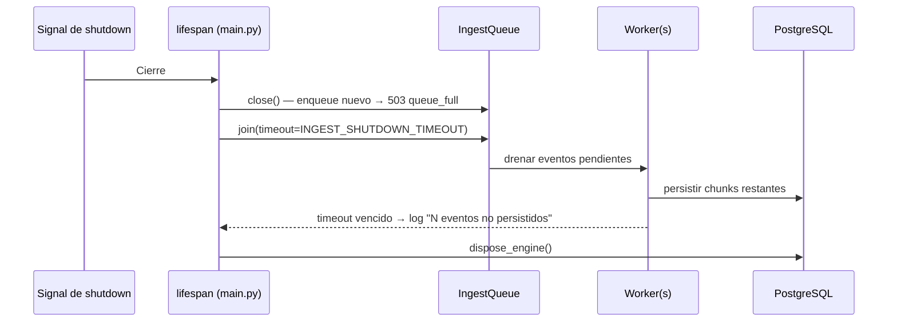

# Design: ISS-S2-03 — Ingesta RUM asíncrona

## Enfoque técnico

Pipeline de ingesta desacoplado del request según E1 (exploración §4): handlers `POST /telemetry/*` autenticados con `Depends(require_api_key)` (RUM-1, IAUTH-5), validación de dos niveles en el request (envelope→400, evento→202 parcial; RUM-2..RUM-4), encolado tras un puerto `IngestQueue` con implementación `asyncio.Queue` acotada (RUM-5), workers en el lifespan que persisten a `rum_metric`/`js_exception`/`user_session` (RUM-6, D1), drenado en shutdown (RUM-7, D6) y observabilidad por logs estructurados + contadores en proceso (RUM-8, D4). La validación y el encolado ocurren en el request; el worker solo persiste. El tenant de cada evento se fija en el encolado (app autenticada, D2/IAUTH-2): el worker nunca deriva autoridad del payload.

## Decisiones de arquitectura

**Confirmadas (D1–D6, no se re-abren):** D1 persistencia a BD · D2 `application_id` opcional, sin `unknown_application` · D3 429 solo declarado · D4 sin prometheus-client · D5 422→400 · D6 drenado con timeout.

| # | Decisión | Alternativas | Trade-off → elección |
|---|----------|--------------|----------------------|
| DD-1 | Puerto `IngestQueue` (Protocol: `enqueue`/`close`/`join`) + `AsyncioIngestQueue` sobre `asyncio.Queue(maxsize=ingest_queue_maxsize)` + N workers | Broker externo (E3), `BackgroundTasks` (E2), worker separado (E4) | Sin infra nueva ($0/mo, <2GB RAM); backpressure nativa; interfaz abstrae migración futura a broker durable (Pipeline §3). Cola por proceso: CMD uvicorn 1 worker (R6, RUM-5) |
| DD-2 | Validación por evento en `ingest_policy.py` (puro, sin I/O): 7 códigos de RUM-4, sin `unknown_application`; `application_id` opcional e ignorado como autoridad | Validar en worker | Fallo temprano + 202 parcial determinista; política unit-testable sin cola ni BD |
| DD-3 | Worker: sesión async propia por chunk; `user_session` ON CONFLICT DO NOTHING; bulk insert `rum_metric` (type→`metric_type_id` con catálogo cacheado) y `js_exception` (`metric_id` inexistente→NULL + contador); chunks de 500, 1 transacción/chunk | Insert por evento | Throughput + atomicidad por chunk; retry granular |
| DD-4 | Retry 3 con backoff 0.5/1/2 s solo errores transitorios de BD (`OperationalError`/conexión/timeout/`asyncpg.PostgresConnectionError`); permanentes → dead-letter (log + contador) | Sin retry / retry todo | Sin pérdida silenciosa (RUM-6); no enmascarar errores permanentes |
| DD-5 | Handler global `RequestValidationError` que traduce a 400 `schema_validation_error` SOLO en paths `/telemetry/*`; resto conserva 422 | Traducir en todos los paths | Cumple contrato (OAS-11) sin romper 422 existentes de `/applications` |
| DD-6 | Shutdown: `close()` (deja de aceptar→503) → `join(timeout=ingest_shutdown_timeout)` → loguear no persistidos → `dispose_engine()` | Descartar y loguear | Drena sin exceder la ventana de apagado (RUM-7) |
| DD-7 | ADR-0002 documenta pipeline async sin broker + reversión de nomenclatura S1 a `/telemetry/*` (supersede interfaces.md §1) | ADR solo del pipeline | Un solo artefacto Nygard (R7), decisión de naming con contexto |

## Flujo de datos

```
Request X-API-Key ─→ require_api_key ─→ Application (tenant)
    │
    ├─ envelope inválido ──────────────→ 400 schema_validation_error (422→400)
    ├─ evento inválido ── rejected[{index,reason}] (contador+log ADR-23) ─→ 202 parcial
    ├─ cola llena ─────────────────────→ 503 queue_full (put_nowait, sin bloqueo)
    └─ evento válido ─→ enqueue(tenant, payload) ─→ 202 {batch_id, accepted, rejected}
                              │
                         asyncio.Queue(maxsize) ─→ worker(s) ─→ chunk 500
                              │                        │
                              │              retry 3 (0.5/1/2s) ─→ dead-letter
                              └─ session ──→ user_session (ON CONFLICT DO NOTHING)
                                            → rum_metric / js_exception (bulk)
```

## Diagramas de secuencia

```mermaid
sequenceDiagram
    participant A as Agente RUM
    participant R as Router telemetry.py
    participant S as IngestService
    participant Q as IngestQueue (asyncio.Queue)
    participant W as Worker(s)
    participant DB as PostgreSQL

    A->>R: POST /telemetry/metrics (X-API-Key, RumEventBatch)
    R->>R: require_api_key → Application (tenant)
    R->>S: process_batch(batch, tenant)
    S->>S: Validación envelope (schema_version, ≤500) → 400 si falla
    S->>S: Validación por evento (política) → rejected[{index, reason}]
    S->>Q: enqueue(tenant, evento) — put_nowait; QueueFull → 503
    S-->>A: 202 {batch_id, accepted, rejected} (al encolar, no al persistir)
    Q->>W: get() hasta chunk de 500
    W->>DB: INSERT user_session ... ON CONFLICT DO NOTHING
    W->>DB: Bulk INSERT rum_metric / js_exception (1 transacción/chunk)
    W-->>W: Transitorio → retry (0.5/1/2s); permanente → dead-letter (log+contador)
```



## Archivos

| Archivo | Acción | Descripción |
|---------|--------|-------------|
| `src/api/presentation/routers/telemetry.py` | Crear | 2 endpoints `POST /telemetry/{metrics,exceptions}` con `Depends(require_api_key)`; queue desde `app.state` |
| `src/api/domain/services/ingest_service.py` | Crear | `IngestService.process_batch`: batch_id (uuid4), validación envelope+evento, encolado, contadores, 202 |
| `src/api/domain/services/ingest_policy.py` | Crear | Política pura por evento (7 códigos, límites 500/50, rangos de cordura, ratings no rechazan) |
| `src/api/infrastructure/ingest/queue.py` | Crear | Puerto `IngestQueue` (Protocol) + `AsyncioIngestQueue`: workers, retry, dead-letter, drenado |
| `src/api/infrastructure/ingest/counters.py` | Crear | Contadores en proceso (`received/accepted/rejected{reason}/persisted/dead_letter/metric_id_unknown/queue_depth`) + snapshot |
| `src/api/domain/entities/{user_session,rum_metric,js_exception}.py` | Crear | Entidades ORM (mirror DDL 0001) |
| `src/api/domain/repositories/ingest_repository.py` | Crear | Protocol `IngestRepository` (upsert_session, bulk_metrics, bulk_exceptions) — sin commit (ADR-10) |
| `src/api/infrastructure/db/repositories/sqlalchemy_ingest_repository.py` | Crear | Impl con `insert()` Core + catálogo `metric_type` cacheado |
| `src/api/presentation/schemas/ingest.py` | Crear | Pydantic espejo del contrato (`application_id` opcional, OAS-12) + `IngestResponse` |
| `src/api/domain/exceptions.py` | Modificar | `ServiceUnavailableError` (503, `default_code="queue_full"`) |
| `src/api/presentation/errors.py` | Modificar | Handler `RequestValidationError` scoped a `/telemetry/*` → 400 (D5) |
| `src/api/config.py` | Modificar | `ingest_queue_maxsize=10000`, `ingest_workers=2`, `ingest_shutdown_timeout=10.0` (env `INGEST_QUEUE_MAXSIZE`/`INGEST_WORKERS`/`INGEST_SHUTDOWN_TIMEOUT`) |
| `src/api/main.py` | Modificar | Lifespan: crear cola+workers al startup; shutdown `close→join→dispose`; registrar router + handler 422→400 |
| `openspec/specs/openapi.yaml` | Modificar | Paths `/telemetry/*` con `security:[apiKey]` + 401/403, quitar `/metrics/ingest`/`/logs/ingest`, scheme descripción, `application_id` fuera de required (OAS-6/11/12) |
| `openspec/specs/architecture/{interfaces,components,quality-attributes}.md` | Modificar | ARCH-1..3 (nomenclatura, árbol `routers/telemetry.py`, artefacto) |
| `docs/architecture/PipelineIngestaRUM.md`, `ContratoIngestaRUM.md`, `docs/brief-v2.md` | Modificar | ARCH-4 (rutas `/telemetry/*`, semántica 202/503; históricos intactos) |
| `docs/adr/0002-pipeline-ingesta-async.md` | Crear | ADR Nygard (DD-7) |
| `tests/test_ingest_telemetry.py` | Crear | TDD: validación, 202/400/401/403/503, IAUTH-2, persistencia, retry/dead-letter, shutdown |
| `tests/test_contract.py`, `tests/test_ingest_auth.py` | Modificar | OAS-6/9/10 + `_SCOPED_PATH_RE`+telemetry; wiring inverso de IAUTH-5 |
| `CHANGELOG.md` | Modificar | Registro del cambio |

## Interfaces / Contratos

```python
# src/api/infrastructure/ingest/queue.py
class IngestQueue(Protocol):
    """Puerto de cola — migrable a broker durable (Pipeline §3)."""
    async def enqueue(self, event: QueuedEvent) -> None: ...
    async def close(self) -> None: ...
    async def join(self, timeout: float) -> None: ...

class AsyncioIngestQueue:
    """asyncio.Queue(maxsize) + N workers; enqueue = put_nowait.
    QueueFull o cola cerrada → ServiceUnavailableError(code="queue_full")."""

# Patrón no obvio: handler 422→400 scoped (D5)
async def validation_error_handler(request: Request, exc: RequestValidationError):
    if request.url.path.startswith("/telemetry/"):
        return JSONResponse(400, ErrorResponse(error=ErrorDetail(
            code="schema_validation_error", message="invalid ingest envelope")))
    raise exc  # conserva 422 del contrato actual en el resto de paths

# Worker: retry solo transitorios
for attempt, delay in enumerate((0.5, 1.0, 2.0), 1):
    try:
        await repo.persist_chunk(chunk); break
    except TRANSIENT_DB_ERRORS:
        if attempt == 3: dead_letter(chunk); break
        await asyncio.sleep(delay)
```

`QueuedEvent` = dataclass `{batch_id, index, tenant_app_id, kind: "metric"|"exception", payload: dict}` — el worker persiste con `tenant_app_id` ya resuelto (D2).

## Estrategia de testing

| Capa | Qué | Cómo |
|------|-----|------|
| Unit | Política por evento (7 códigos RUM-4, límites 500/50, ratings no rechazan), batch_id, contadores | pytest directo sobre `ingest_policy.py`/`counters.py` |
| Integration | 202 parcial con `rejected[{index,reason}]`, 400 envelope, 401/403 guard, 503 `queue_full` (maxsize 1), IAUTH-2 (tenant de key ≠ payload), 202 al encolar | httpx AsyncClient + fixture cola; `app.state.ingest_queue` override |
| Persistencia | Filas en `rum_metric`/`js_exception`/`user_session`; retry transitorio (mock de repo); dead-letter; `metric_id_unknown` → NULL | Postgres real (conftest `clean_db` trunca tablas) |
| Contract | `/telemetry/*` exigen `apiKey`, respuestas 202/400/401/403/503/429, paths viejos ausentes | schemathesis + aserciones OAS-6/9/10/11/12 |
| Shutdown | Drenado antes de `dispose_engine`; timeout loguea no persistidos | Lifespan test con cola precargada |

## Threat Matrix

N/A — sin routing de shell, subprocesos, VCS/PR automation ni ejecutables: la cola es un mecanismo asyncio en proceso (no integración de procesos). Los únicos "routes" son paths HTTP de FastAPI, cubiertos por tests de integración/contrato.

## Migración / Rollout

Sin migración de datos (DDL de S1 ya existe; filas huérfanas no generan deuda). Rollout: revert del PR + revert del diff de `openapi.yaml`/specs de arquitectura. Restricción de runtime documentada: uvicorn 1 worker (cola por proceso, R6).

## Recursos

Footprint: `maxsize=10000` × ~1–2 KB/evento ≈ 10–20 MB peor caso; workers comparten el pool asyncpg existente (`pool_size=20`); sin dependencias nuevas; CPU-only (<2GB RAM, $0/mo).

## Preguntas abiertas

Ninguna — D1..D6 confirmados; ADR de nomenclatura como decisión registrada en DD-7.