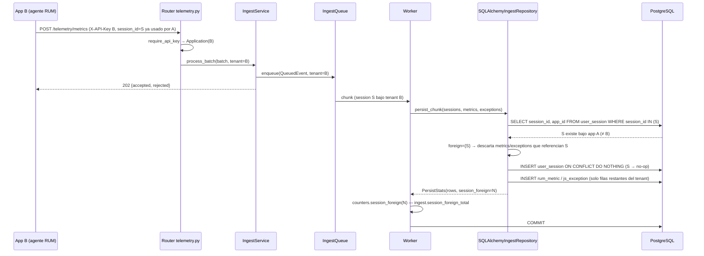
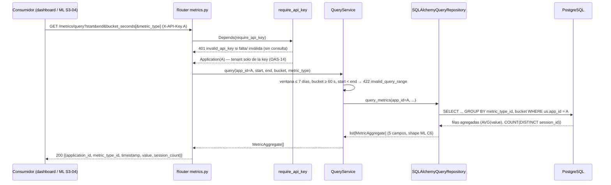
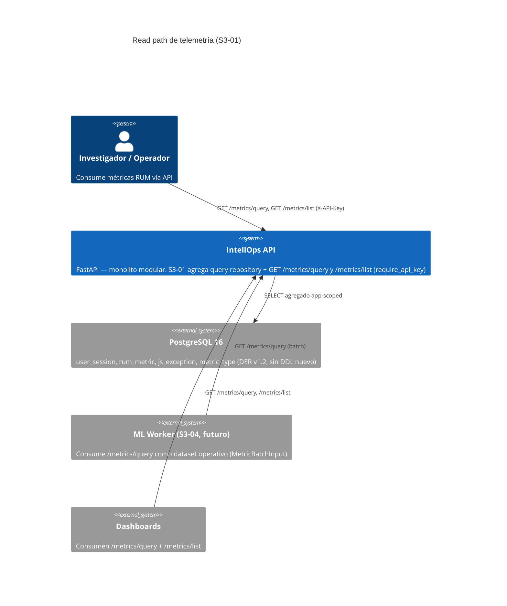

# Design: ISS-S3-01 — Persistencia de telemetría (verificación + hardening + read path)

## Enfoque técnico

Tres frentes sobre la base de ISS-S2-03 (PR #55, develop): (1) **hardening de aislamiento** — el ownership de `user_session` y la correlación `metric_id` se resuelven EN EL REPOSITORIO, antes del insert (hecho de BD, no de service): `_upsert_sessions` consulta los `session_id` existentes del chunk y descarta (con contador) las métricas/excepciones que referencian sesiones de OTRA app; `_bulk_exceptions` reivindica `metric_id` solo si existe Y pertenece a una sesión del tenant del lote (si no → `NULL` + contador). (2) **read path** — `QueryRepository` app-scoped (JOIN `user_session→rum_metric` con `app_id = tenant`) con agregación temporal EN SQL (sin materializar filas), shape ML `(application_id, metric_type_id, timestamp, value, session_count)` (C6, `MetricBatchInput`), expuesto vía `GET /metrics/query` + `GET /metrics/list` con `Depends(require_api_key)` (OAS-13/OAS-14). (3) **verificación** — tests TDD de collision/replay (C5), correlación scoped y contrato openapi 124-137 completado + Schemathesis verde. Sin DDL nuevo (sin migración), sin rewiring de ML (S3-04).

## Decisiones de arquitectura (ADR-0003 — Nygard)

| # | Decisión | Alternativas | Trade-off → elección |
|---|----------|--------------|----------------------|
| DD-8 | Ownership resuelto en `_upsert_sessions` (SELECT de sesiones existentes del chunk por PK antes del insert; extranjeras → descarte + `session_foreign_total`) | Check en service layer (TOCTOU: la sesión puede crearse entre encolado y persistencia; el service no tiene sesión de BD); `WHERE app_id = tenant` en el conflict (no soportado: `ON CONFLICT DO NOTHING` no admite filtro, el target es la constraint); índice único `(session_id, app_id)` (DDL nuevo, fuera de scope) | La propiedad de la sesión es un hecho transaccional de BD que el worker observa en el mismo `AsyncSession` del chunk → sin ventana TOCTOU entre check y write; sin DDL |
| DD-9 | Agregación del read path EN SQL: una sola sentencia `SELECT ... GROUP BY metric_type_id + bucket` (epoch-bucket anclado al inicio de ventana), `AVG(value)` + `COUNT(DISTINCT session_id)`, JOIN por `idx_user_session_app_id` | Agregación en memoria (materializa filas del rango en el proceso → RAM y CPU Python; viola < 2GB RAM en ventanas grandes); vista materializada pre-agregada (DDL, fuera de scope) | PostgreSQL agrega sin copiar filas al proceso; el rango por defecto (15 min) escanea pocos miles de filas vía índices existentes → < 2 s, CPU-only, footprint ~0 |
| DD-10 | Contadores nuevos expuestos por el mecanismo existente `IngestCounters.snapshot()` (D4/RUM-8, sin prometheus-client): keys `ingest.session_foreign_total` y `ingest.metric_id_foreign_total`; `PersistStats` gana `session_foreign`/`metric_id_foreign` | Endpoint `/metrics` Prometheus (fuera de scope, D4); log-only (no observable en snapshot) | Reusa el contrato `ingest.` + `_total` de RUM-8; el worker ya consume `PersistStats` → wiring mínimo en `queue.py` |

**ADR-0003**: documentado en `docs/adr/0003-ownership-tenant-read-path.md` (formato Nygard: contexto C2-C4, decisión DD-8/DD-9/DD-10, consecuencias, alternativas). Estado: aceptado al mergear.

## Flujo de datos

```
POST /telemetry/* (key de B) ─→ require_api_key ─→ Application(B)
  └─ enqueue(tenant=B) ─→ worker ─→ chunk 500 ─→ persist_chunk
        ├─ _upsert_sessions: SELECT session_id, app_id WHERE session_id IN (chunk)
        │     ├─ existe bajo app A ≠ B → foreign_session_ids ─→ descarta metrics/exceptions (contador)
        │     └─ INSERT ON CONFLICT DO NOTHING (nuevos insertan; existentes no-op)
        ├─ _bulk_metrics: INSERT rum_metric (type → metric_type_id cacheado)
        └─ _bulk_exceptions: SELECT metric_id JOIN user_session WHERE app_id = B
              ├─ existe y es del tenant → metric_id conservado
              └─ no existe → NULL + metric_id_unknown_total | existe cross-app → NULL + metric_id_foreign_total

GET /metrics/query (key de A) ─→ require_api_key ─→ QueryService (límites)
  └─ SQLAlchemyQueryRepository.query_metrics(app_id=A) ─→ SQL agregado ─→ MetricAggregate[]
GET /metrics/list ─→ catálogo metric_type (metric_type_id, name, description)
```

## Diagramas de secuencia





## C4 context (read path — vista para nuevos integrantes)



## Archivos

| Archivo | Acción | Descripción |
|---------|--------|-------------|
| `src/api/infrastructure/db/repositories/sqlalchemy_ingest_repository.py` | Modificar | `_upsert_sessions` devuelve `set[UUID]` de sesiones extranjeras (SELECT por PK antes del insert); `persist_chunk` filtra metrics/exceptions de sesiones extranjeras y cuenta descartes; `_bulk_exceptions` correlación scoped (`JOIN user_session WHERE app_id = tenant AND session_id IN lote`) → `metric_id_foreign` |
| `src/api/domain/repositories/ingest_repository.py` | Modificar | `PersistStats` + `session_foreign: int = 0` + `metric_id_foreign: int = 0` (defaults → compat con mocks existentes) |
| `src/api/infrastructure/ingest/counters.py` | Modificar | `session_foreign(n)` / `metric_id_foreign(n)`; snapshot keys `ingest.session_foreign_total`, `ingest.metric_id_foreign_total` |
| `src/api/infrastructure/ingest/queue.py` | Modificar | Worker: `if stats.session_foreign: counters.session_foreign(...)`; idem `metric_id_foreign` |
| `src/api/domain/repositories/query_repository.py` | Crear | Puerto `QueryRepository` (Protocol) + DTOs `MetricAggregate` (5 campos C6) y `MetricTypeInfo` |
| `src/api/infrastructure/db/repositories/sqlalchemy_query_repository.py` | Crear | `query_metrics` (SQL agregado, epoch-bucket) + `list_metric_types` (catálogo) |
| `src/api/domain/services/query_service.py` | Crear | Límites TQ-2 (ventana 15 min default / ≤ 7 d, bucket ≥ 60 s, start < end → 422), delega en el repositorio |
| `src/api/domain/exceptions.py` | Modificar | `QueryRangeError(DomainError)` `http_code=422`, `default_code="invalid_query_range"` (patrón ADR-09) |
| `src/api/presentation/schemas/metrics.py` | Crear | `MetricAggregateOut`, `MetricTypeInfoOut` (respuestas 200 de OAS-13) |
| `src/api/presentation/routers/metrics.py` | Crear | `GET /metrics/query` (`operation_id="queryMetrics"`) + `GET /metrics/list` (`listMetrics`), ambos `Depends(require_api_key)` + `Depends(get_session)` |
| `src/api/main.py` | Modificar | `app.include_router(metrics.router)` |
| `openspec/specs/openapi.yaml` | Modificar | Completar 124-137: `security: [apiKey]`, parámetros (`start`, `end`, `bucket_seconds`, `metric_type` opcional en query), respuestas 200 (shape ML / catálogo) + 401/403/422; operationIds y paths intactos (OAS-13) |
| `docs/adr/0003-ownership-tenant-read-path.md` | Crear | ADR Nygard (DD-8/DD-9/DD-10) |
| `tests/test_ingest_telemetry.py` | Modificar | Collision/replay (C5), reenvío mismo tenant, correlación cross-app/legítima/inexistente, snapshot RUM-11 |
| `tests/test_metrics_query.py` | Crear | TQ-1 (shape ML, buckets), TQ-2 (límites), OAS-14 (401, aislamiento por key), /metrics/list |
| `tests/test_contract.py` | Modificar | OAS-13 estructural (operationIds, security, parámetros) + `_SCOPED_PATH_RE` += `metrics` |
| `CHANGELOG.md` | Modificar | Registro del cambio |

## Interfaces / Contratos

```python
# src/api/domain/repositories/ingest_repository.py (delta)
@dataclass(frozen=True)
class PersistStats:
    rows: int
    metric_id_unknown: int
    session_foreign: int = 0   # filas descartadas por sesión extranjera (RUM-9)
    metric_id_foreign: int = 0 # metric_id existente pero de otro tenant (RUM-10)

# src/api/domain/repositories/query_repository.py (nuevo)
@dataclass(frozen=True)
class MetricAggregate:   # shape ML C6 (MetricBatchInput sin metric_id: fila agregada)
    application_id: UUID
    metric_type_id: int
    timestamp: datetime  # inicio del bucket (anclado a la ventana)
    value: float         # AVG(value) del bucket
    session_count: int   # COUNT(DISTINCT session_id)

class QueryRepository(Protocol):
    async def query_metrics(self, app_id: UUID, start: datetime, end: datetime,
                            bucket_seconds: int, metric_type_id: int | None = None) -> list[MetricAggregate]: ...
    async def list_metric_types(self) -> list[MetricTypeInfo]: ...

# Patrón no obvio: _upsert_sessions ahora resuelve ownership ANTES del insert
async def _upsert_sessions(self, sessions: list[SessionRow]) -> set[UUID]:
    result = await self._session.execute(
        select(UserSession.session_id, UserSession.app_id)
        .where(UserSession.session_id.in_([r.session_id for r in sessions]))
    )
    owned = dict(result)  # session_id → app_id existente
    foreign = {r.session_id for r in sessions
               if r.session_id in owned and owned[r.session_id] != r.app_id}
    # ... INSERT ON CONFLICT DO NOTHING igual que hoy (extranjeros → no-op)
    return foreign

# Query SQL del read path (una sentencia, sin materializar filas)
SELECT us.app_id AS application_id,
       rm.metric_type_id,
       to_timestamp(EXTRACT(EPOCH FROM :start)
                    + floor((EXTRACT(EPOCH FROM rm.timestamp) - EXTRACT(EPOCH FROM :start))
                            / :bucket_s) * :bucket_s) AS timestamp,
       AVG(rm.value)::float8 AS value,
       COUNT(DISTINCT rm.session_id)::int AS session_count
FROM rum_metric rm
JOIN user_session us ON us.session_id = rm.session_id
WHERE us.app_id = :app_id AND rm.timestamp >= :start AND rm.timestamp < :end
  [AND rm.metric_type_id = :metric_type_id]
GROUP BY us.app_id, rm.metric_type_id, timestamp
ORDER BY timestamp, rm.metric_type_id
```

## Plan de acceso a datos

- **Ingesta (ownership)**: 1 `SELECT` por chunk sobre PK `user_session(session_id)` (≤ 500 ids) — O(chunk), índice PK. Correlación scoped: `SELECT rm.metric_id ... JOIN user_session us ON us.session_id = rm.session_id WHERE us.app_id = :tenant AND rm.session_id IN (lote)` — filtra por `idx_user_session_app_id` + PK `rum_metric.metric_id`. Sin scans amplios.
- **Read path (TQ-2)**: predicado `us.app_id = :app_id` → `idx_user_session_app_id`; rango `rm.timestamp` → `idx_rum_metric_type_timestamp` (con `metric_type`) o `idx_rum_metric_session_timestamp` (sin filtro de tipo, join por sesión). Sin DDL nuevo. La agregación ocurre en PostgreSQL (hash aggregate sobre el rango filtrado); el proceso recibe solo las filas agregadas (buckets × tipos ≤ decenas). Ventana default 15 min → escaneo de miles de filas, < 2 s garantizado por plan indexado; peor caso 7 días acotado por el rango. Bucket por epoch anclado a `:start` (determinista, alineado a la ventana del request, no a medianoche UTC).

## Estrategia de testing

| Capa | Qué | Cómo |
|------|-----|------|
| Unit | Contadores nuevos + keys de snapshot (RUM-11); partición foreign en `_upsert_sessions` (repo fake); límites de `QueryService` (ventana/bucket/orden → 422, sin llamar al repo) | pytest directo |
| Integration | **Collision/replay C5** (Postgres real): sesión S bajo app A → app B envía metrics+exceptions con `session_id=S` → **assert en BD**: `rum_metric`/`js_exception` sin filas de B, `user_session.app_id` sigue siendo A, datos de A intactos, `ingest.session_foreign_total` == filas descartadas | httpx/cola + SQL directo (patrón `test_worker_persists_batch_to_postgres`) |
| Integration | Reenvío mismo tenant → no-op, sin contador (RUM-9); correlación cross-app → `metric_id` NULL + `ingest.metric_id_foreign_total`; reivindicación legítima conserva `metric_id`; inexistente → `metric_id_unknown_total` (RUM-10/RUM-6) | idem |
| Integration | Read path: shape ML exacto (5 campos) y app-scoped (datos de B invisibles para A); 1 fila por bucket con `AVG` + `COUNT(DISTINCT session_id)` correctos; rango fuera de límite → 422 sin ejecutar agregación; `GET /metrics/list` devuelve catálogo (TTFB…RAGE_CLICK); smoke de latencia ventana default < 2 s | pytest + AsyncClient + SQL seed |
| Contract | OAS-13: operationIds `queryMetrics`/`listMetrics` intactos, `security: [apiKey]`, parámetros y respuestas 200/401/403/422; Schemathesis verde sobre el subset con `_SCOPED_PATH_RE` extendido a `metrics` | `tests/test_contract.py` (aserciones estructurales + schemathesis live, ADR-24) |

## Threat Matrix

N/A — sin routing de shell, subprocesos, VCS/PR automation ni integración de procesos: el read path agrega paths HTTP de FastAPI (cubiertos por tests de integración/contrato y el guard `require_api_key`); la cola sigue siendo asyncio en proceso. Ninguna fila del matrix es aplicable.

## Migración / Rollout

**Sin migración de datos** (fix de ownership es lógica de upsert/repo; read path solo SELECT). **Rollback**: revert del PR — sin DDL nuevo, sin rollback de esquema. Datos: las filas descartadas durante la vigencia del cambio NUNCA se insertaron → sin deuda residual ni datos huérfanos. Comportamiento de contadores en rollback: `ingest.session_foreign_total`/`ingest.metric_id_foreign_total` desaparecen del `snapshot()` (vuelve la forma pre-S3-01); los demás keys intactos. Advertencia: el revert reabre el gap CRITICAL C2-C4 (sesiones cross-tenant vuelven a persistirse) — el re-merge del PR lo restaura.

## Recursos

Footprint: SELECTs de ownership/correlación acotados al chunk (≤ 500 ids); agregación íntegra en PostgreSQL (sin materializar filas en proceso); respuesta del read path ≤ decenas de filas. Sin dependencias nuevas. CPU-only, < 2 GB RAM, $0/mo (config.yaml). Latencia read path < 2 s en ventana default (plan indexado, TQ-2).

## Preguntas abiertas

Ninguna — DD-8/DD-9/DD-10 confirmados contra spec y archivo S2-03; el shape agregado (sin `metric_id`) es el contrato explícito de TQ-1 (S3-04 mapeará a `MetricBatchInput`).