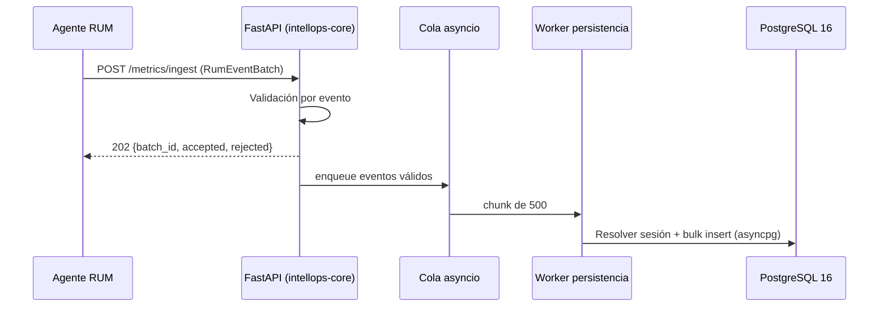
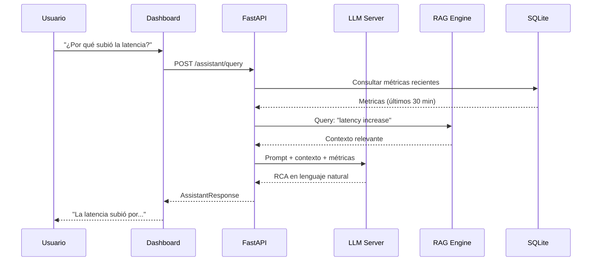

# Components Specification — IntellOps

- **Versión**: 1.0
- **Fecha**: 2026-05-27
- **Autores**: Emanuel Rodriguez, Equipo InfraIT GIDAS

## 1. Componentes del Backend (FastAPI)

### 1.1. API Router Structure

```
src/api/
├── main.py                    ← FastAPI app, startup/shutdown, middlewares
├── routers/
│   ├── health.py              ← GET /health, GET /ready
│   ├── ingest.py              ← POST /metrics/ingest, POST /logs/ingest
│   ├── metrics.py             ← GET /metrics/query, GET /metrics/list
│   ├── anomalies.py           ← GET /anomalies, GET /anomalies/{id}
│   ├── predictions.py         ← GET /predictions, GET /predictions/forecast
│   ├── alerts.py              ← GET /alerts, POST /alerts/config, PUT /alerts/{id}/ack
│   ├── dashboard.py           ← GET /dashboard/summary, GET /dashboard/heatmap
│   ├── assistant.py           ← POST /assistant/query (RAG + LLM)
│   └── admin.py               ← GET/PUT /admin/config, GET /admin/status
├── models/
│   ├── metric.py              ← MetricBatch, MetricSeries, MetricQuery
│   ├── anomaly.py             ← AnomalyResult, AnomalyList
│   ├── prediction.py          ← PredictionResult, ForecastRequest
│   ├── alert.py               ← AlertConfig, AlertEvent
│   ├── dashboard.py           ← DashboardSummary, HeatmapData
│   └── assistant.py           ← AssistantQuery, AssistantResponse
├── services/
│   ├── ingest_service.py      ← Lógica de ingesta: validación, batching, escritura
│   ├── query_service.py       ← Lógica de consulta: agregación, filtros temporales
│   ├── ml_service.py          ← Interface con ML Engine
│   ├── llm_service.py         ← Interface con LLM Server + RAG
│   ├── alert_service.py       ← Evaluación de reglas, envío de notificaciones
│   └── config_service.py      ← Gestión de configuración del sistema
├── db/
│   ├── connection.py          ← Conexión SQLite, WAL mode, connection pool
│   ├── migrations.py          ← Migraciones de esquema
│   ├── repositories/
│   │   ├── metric_repo.py     ← CRUD de métricas
│   │   ├── anomaly_repo.py    ← CRUD de anomalías
│   │   ├── alert_repo.py      ← CRUD de configuraciones de alertas
│   │   └── config_repo.py     ← CRUD de configuración
│   └── models.py              ← SQLAlchemy ORM models (o raw SQL)
├── middleware/
│   ├── auth.py                ← API key validation, rate limiting
│   ├── logging.py             ← Request/response logging
│   └── cors.py                ← CORS configuration
└── core/
    ├── config.py              ← Configuración del sistema (pydantic-settings)
    ├── exceptions.py          ← Excepciones personalizadas
    └── dependencies.py        ← FastAPI dependencies
```

### 1.2. Componentes del ML Engine

```
src/ml/
├── main.py                    ← Orquestador: scheduling, feature engineering
├── detectors/
│   ├── isolation_forest.py    ← Isolation Forest detector
│   ├── zscore_detector.py     ← Z-score dinámico detector
│   ├── seasonal_detector.py   ← Seasonal decomposition detector
│   └── ensemble.py            ← Ensamble de detectores (voting/average)
├── forecasters/
│   ├── statistical_forecaster.py ← Holt-Winters, ARIMA simple
│   └── ml_forecaster.py       ← Model-based forecasting (extensión futura)
├── features/
│   ├── extractors.py          ← Feature engineering from raw metrics
│   └── transformers.py        ← Normalization, scaling, encoding
├── pipeline/
│   ├── train.py               ← Training pipeline
│   ├── predict.py             ← Inference pipeline
│   └── evaluate.py            ← Evaluation metrics, drift detection
└── api/
    ├── schemas.py             ← ML service request/response schemas
    └── service.py             ← Internal API for backend communication
```

### 1.3. Componentes del Dashboard (React)

```
src/dashboard/
├── src/
│   ├── App.jsx               ← Main app, routing, layout
│   ├── views/
│   │   ├── LatenciasView.jsx  ← Vista de latencias en tiempo real
│   │   ├── HeatmapView.jsx    ← Mapa de calor de infraestructura
│   │   └── PrediccionesView.jsx ← Panel de predicciones y alertas
│   ├── components/
│   │   ├── MetricCard.jsx     ← Tarjeta de métrica individual
│   │   ├── TimeSeriesChart.jsx ← Gráfico de serie temporal (D3.js)
│   │   ├── HeatmapChart.jsx   ← Mapa de calor (D3.js)
│   │   ├── AlertBadge.jsx     ← Badge de alerta
│   │   ├── AssistantChat.jsx  ← Chat con asistente GenIA
│   │   ├── SkeletonLoader.jsx ← Skeleton screens para carga
│   │   └── ErrorBoundary.jsx  ← Manejo de errores
│   ├── hooks/
│   │   ├── useMetrics.js      ← Hook para polling de métricas
│   │   ├── useAnomalies.js    ← Hook para consulta de anomalías
│   │   └── useAssistant.js    ← Hook para chat con asistente
│   ├── services/
│   │   └── api.js             ← Cliente HTTP para backend API
│   └── styles/
│       └── index.css          ← Estilos globales
├── public/
│   └── index.html
├── vite.config.js
└── package.json
```

### 1.4. Componentes del Agente RUM (JavaScript)

```
src/agent/
├── rum.js                    ← Main bundle entry point
├── collectors/
│   ├── web-vitals.js         ← Core Web Vitals collector (LCP, INP, CLS)
│   ├── navigation.js         ← Navigation timing, TTFB
│   ├── errors.js             ← Error rate, error tracking
│   └── session.js            ← Session replay metadata
├── transport/
│   └── http.js               ← HTTP transport with batching
├── config.js                 ← Configuración del agente
└── index.js                  ← Initialization and lifecycle
```

## 2. Flujos de Componentes

### 2.1. Flujo de Ingesta de Métricas



### 2.2. Flujo de Consulta con Asistente GenIA



## 3. Módulos del Proyecto (Cross-Cutting)

| Módulo | Componentes | Backend/Frontend | Responsable |
|--------|------------|------------------|-------------|
| Captura | Agente RUM, ingest API | Backend + JS | Romeo / Ema |
| Almacenamiento | SQLite, repositorios | Backend | Ema |
| ML | Detectores, pipeline, serving | Backend ML | Romeo |
| GenIA | LLM Server, RAG, chat | Backend ML + Frontend | TBD |
| Dashboard | React views, charts, assistant chat | Frontend | Romeo / Ema |
| Seguridad | Hardening, GLP dashboards, ELK → GLP | Infraestructura | Federico |
| QA/CI | Tests, pipelines, quality gates | Infraestructura | Santiago |
