# Containers Specification — IntellOps

- **Versión**: 1.0
- **Fecha**: 2026-05-27
- **Autores**: Emanuel Rodriguez, Equipo InfraIT GIDAS

## 1. Diagrama C4 de Contenedores (Nivel 2)

```mermaid
C4Container
    Person(sre, "SRE Estudiante", "Usuario del sistema")

    System_Boundary(intellops, "IntellOps") {
        Container(agent, "Agente RUM", "JavaScript", "Recolecta métricas y traces del browser/servicio")
        Container(api, "FastAPI Backend", "Python 3.11", "API REST de ingesta, consulta y configuración")
        Container(db, "SQLite DB", "SQLite + time-index", "Almacenamiento de métricas, eventos y configuración")
        Container(ml, "ML Engine", "Python + scikit-learn", "Detección de anomalías, forecasting")
        Container(llm, "LLM Server", "Llama 3.2 1B + llama.cpp", "Inferencia de GenIA local para RCA")
        Container(rag, "RAG Engine", "sentence-transformers + Chroma", "Vectorización y recuperación de contexto")
        Container(dash, "React Dashboard", "React + D3.js", "Visualización de métricas, anomalías y predicciones")
        Container(prom, "Prometheus", "Go", "Almacenamiento de métricas de infraestructura")
        Container(loki, "Loki", "Go", "Agregación de logs del sistema")
        Container(grafana, "Grafana", "Go + React", "Dashboards de seguridad y monitoreo")
        Container(otelcol, "OTel Collector", "Go", "Recepción, procesamiento y enrutamiento de señales OTel (trazas, métricas, logs)")
    Container(tempo, "Tempo", "Go", "Almacenamiento y consulta de trazas distribuidas (OTel-native)")
    Container(alertmgr, "Alertmanager", "Go", "Routing y notificaciones multicanal de alertas")
    Container(netdata, "Netdata", "C", "Auto-monitoreo del sistema IntellOps")
    }

    Container_Ext(monitored, "Sistemas Monitoreados", "Servidores, apps, servicios GIDAS")
    Container_Ext(notifications, "Canales de Notificación", "Mail, Telegram, WhatsApp")

    Rel(agent, otelcol, "OTLP", "Trazas + métricas de frontend")
    Rel(monitored, otelcol, "OTLP", "Señales de infraestructura")
    Rel(otelcol, tempo, "OTLP", "Trazas")
    Rel(otelcol, loki, "OTLP", "Logs")
    Rel(otelcol, prom, "OTLP", "Métricas")
    Rel(api, otelcol, "OTLP", "Auto-instrumentación FastAPI")
    Rel(tempo, grafana, "Datasource", "Trazas")
    Rel(api, db, "Read/Write", "SQLite")
    Rel(api, ml, "gRPC/internal", "Feature vectors")
    Rel(ml, db, "Read", "Datos históricos")
    Rel(llm, rag, "Query", "Contexto relevante")
    Rel(rag, db, "Read", "Documentación y runbooks")
    Rel(dash, api, "HTTP GET", "REST API")
    Rel(sre, dash, "Visualiza", "Dashboard UX")
    Rel(sre, grafana, "Visualiza", "Dashboards unificados")
    Rel(grafana, alertmgr, "Dispatch", "Alertas")
    Rel(alertmgr, notifications, "Webhook/API", "Notificaciones multicanal")
    Rel(prom, api, "Scrape", "Métricas de la API")
    Rel(loki, api, "Read", "Logs del sistema")
    Rel(grafana, prom, "Datasource", "Métricas")
    Rel(grafana, loki, "Datasource", "Logs")
    Rel(netdata, prom, "Export", "Métricas del sistema")
```

## 2. Descripción de Contenedores

### 2.1. Agente RUM (JavaScript)

| Atributo | Valor |
|----------|-------|
| **Propósito** | Recolectar métricas de experiencia de usuario desde el browser |
| **Tecnología** | JavaScript vanilla (sin framework), bundle < 50KB |
| **Métricas** | Core Web Vitals (LCP, INP, CLS), TTFB, error rate, page load |
| **Sampling** | 10% configurable, batch cada 30s |
| **Comunicación** | HTTP POST a `/metrics/ingest`, payload JSON |
| **Recursos** | < 5MB RAM en browser, sin impacto en rendimiento de página |

### 2.2. FastAPI Backend (Python)

| Atributo | Valor |
|----------|-------|
| **Propósito** | API REST de ingesta, consulta y configuración del sistema |
| **Framework** | FastAPI + Uvicorn (ASGI) |
| **Puertos** | 8000 (API), 8001 (health/metrics) |
| **Endpoints** | Ver `interfaces.md` |
| **Recursos** | < 100MB RAM, < 1 core CPU |
| **Dependencias** | SQLite3, httpx, pydantic, pyyaml |
| **Auto-docs** | Swagger UI (`/docs`) + Redoc (`/redoc`) |

### 2.3. SQLite DB

| Atributo | Valor |
|----------|-------|
| **Propósito** | Almacenamiento persistente de métricas, eventos y configuración |
| **Modo** | WAL (Write-Ahead Log) para mejor concurrencia |
| **Índice** | Índice temporal compuesto (timestamp + metric_name) |
| **Retención** | Configurable, default 90 días para métricas |
| **Tamaño** | ~500MB/año para 1K métricas/seg |
| **Migración** | Diseñado para migración transparente a TimescaleDB |

### 2.4. ML Engine (Python + scikit-learn)

| Atributo | Valor |
|----------|-------|
| **Propósito** | Detección de anomalías en tiempo real y forecasting |
| **Modelos** | Isolation Forest, Z-score dinámico, Seasonal Decomposition |
| **Inferencia** | < 500ms en CPU, modo batch cada 60s |
| **Entrenamiento** | Batch programado (diario/semanal), no online learning |
| **Recursos** | < 50MB RAM en inferencia, < 200MB en entrenamiento |
| **MLflow** | Tracking de experimentos y modelos |
| **DVC** | Versionado de datasets y pipelines |

### 2.5. LLM Server (Llama 3.2 + llama.cpp)

| Atributo | Valor |
|----------|-------|
| **Propósito** | Inferencia local de GenIA para asistente conversacional |
| **Modelo** | Llama 3.2 1B GGUF Q4_K_M (~600MB) |
| **Framework** | llama.cpp con servidor HTTP |
| **Puerto** | 8080 (API compatible OpenAI) |
| **Velocidad** | 5-10 tok/s en CPU (4 cores) |
| **Recursos** | ~600MB RAM, 2-4 cores CPU, sin GPU |

### 2.6. RAG Engine (sentence-transformers + Chroma)

| Atributo | Valor |
|----------|-------|
| **Propósito** | Vectorización de documentación GIDAS + runbooks para contexto del LLM |
| **Embeddings** | all-MiniLM-L6-v2 (80MB, CPU, ~10ms/query) |
| **Vector DB** | Chroma (embeddings + metadata) |
| **Documentos** | Documentación GIDAS, runbooks históricos, ADRs |
| **Recursos** | < 200MB RAM, CPU-only |

### 2.7. React Dashboard

| Atributo | Valor |
|----------|-------|
| **Propósito** | Visualización centrada en UX para las 4 personas definidas |
| **Framework** | React + Vite + D3.js |
| **Bundle** | < 1MB (static build sin SSR) |
| **Vistas** | 3 vistas principales (latencias, heatmap, predicciones) |
| **Actualización** | Polling HTTP cada 15s (sin WebSocket) |
| **Hosting** | Nginx statico o GitHub Pages |

### 2.8. Prometheus

| Atributo | Valor |
|----------|-------|
| **Propósito** | Almacenamiento de métricas de infraestructura (scraping) |
| **Configuración** | Scrape de FastAPI + Node Exporter + Netdata |
| **Retención** | 15 días (local) |
| **Recursos** | ~256MB RAM |

### 2.9. Loki + Promtail

| Atributo | Valor |
|----------|-------|
| **Propósito** | Agregación y consulta de logs del sistema |
| **Agente** | Promtail (descubrimiento y envío de logs) |
| **Almacenamiento** | Sistema de archivos local (S3 como extensión futura) |
| **Retención** | 30 días |
| **Recursos** | ~256MB RAM (Loki), ~50MB RAM (Promtail) |

### 2.10. Grafana

| Atributo | Valor |
|----------|-------|
| **Propósito** | Dashboards de seguridad y monitoreo cross-cutting |
| **Datasources** | Prometheus (métricas), Loki (logs) |
| **Dashboards** | Seguridad (4 vistas), sistema, ML metrics |
| **Alertas** | Grafana Alerting con webhooks a Discord/Slack |
| **Recursos** | ~256MB RAM |

### 2.11. Netdata

| Atributo | Valor |
|----------|-------|
| **Propósito** | Auto-monitoreo del sistema IntellOps |
| **Recursos** | < 5% CPU, ~150MB RAM, auto-discovery |
| **Métricas** | Per-second de todos los contenedores |

### 2.11. OpenTelemetry Collector

| Atributo | Valor |
|----------|-------|
| **Propósito** | Recepción unificada de señales OTel (trazas, métricas, logs) desde agentes RUM, servicios instrumentados e infraestructura |
| **Tecnología** | OpenTelemetry Collector (Go) con receivers OTLP |
| **Procesamiento** | Batch processor, memory limiter, attributes processor para enriquecer trazas |
| **Exporters** | Tempo (trazas), Loki (logs), Prometheus/Mimir (métricas) |
| **Puertos** | 4317 (gRPC OTLP), 4318 (HTTP OTLP) |
| **Recursos** | < 100MB RAM, < 0.5 core CPU |

### 2.12. Tempo (Grafana)

| Atributo | Valor |
|----------|-------|
| **Propósito** | Almacenamiento y consulta de trazas distribuidas con integración nativa OTel |
| **Protocolo** | OTLP gRPC desde OpenTelemetry Collector |
| **Almacenamiento** | Sistema de archivos local (S3 como extensión futura) |
| **Retención** | 30 días |
| **Búsqueda** | Por trace ID, servicio, duración, tags |
| **Recursos** | ~256MB RAM |

### 2.13. Alertmanager

| Atributo | Valor |
|----------|-------|
| **Propósito** | Routing inteligente de alertas desde Grafana a múltiples canales de notificación |
| **Canales** | Mail (SMTP), Telegram (bot API), WhatsApp (API WhatsApp Business / ntfy bridge) |
| **Routing** | Por severidad, servicio, horario (ej: criticidad alta → WhatsApp, media → Telegram, baja → Mail) |
| **Silenciamiento** | Ventanas de mantenimiento, deduplicación, agrupación |
| **Tecnología** | Grafana Alertmanager o Alertmanager independiente |
| **Recursos** | < 50MB RAM |

## 3. Footprint Total Estimado

| Contenedor | RAM (MB) | CPU (cores) | Disco (GB) |
|-----------|----------|-------------|------------|
| FastAPI Backend | ~100 | ~0.5 | ~0.1 |
| SQLite | ~10 | ~0.1 | ~0.5/año |
| ML Engine | ~50 | ~0.5 | ~0.5 |
| LLM Server | ~600 | ~2.0 | ~0.6 |
| RAG Engine | ~200 | ~0.5 | ~0.3 |
| React Dashboard (Nginx) | ~50 | ~0.1 | ~0.1 |
| OTel Collector | ~100 | ~0.5 | ~0.1 |
| Tempo | ~256 | ~0.5 | ~5 |
| Prometheus | ~256 | ~0.5 | ~2 |
| Loki | ~256 | ~0.5 | ~5 |
| Grafana | ~256 | ~0.3 | ~0.5 |
| Alertmanager | ~50 | ~0.1 | ~0.1 |
| Netdata | ~150 | ~0.3 | ~0.5 |
| **Total** | **~2,334 MB** | **~6.4 cores** | **~15.3 GB** |

*Nota: No todos los contenedores están activos simultáneamente al 100%. El LLM Server y ML Engine se activan bajo demanda. OTel Collector y Tempo son los nuevos componentes del stack LGTM. El footprint estable es < 1.5GB RAM.*
