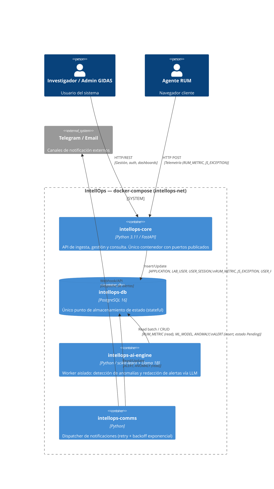

# Containers Specification — IntellOps

- **Versión**: 2.0
- **Fecha**: 2026-09-01
- **Autores**: Equipo InfraIT GIDAS
- **Referencias**: [`docs/infrastructure/Diagrama-C4-V2.puml`](../../../docs/infrastructure/Diagrama-C4-V2.puml), [`docs/der/Trazabilidad DER a Contenedores.md`](../../../docs/der/Trazabilidad%20DER%20a%20Contenedores.md), [`docker-compose.yml`](../../../docker-compose.yml)

> Esta versión reemplaza el diseño previo de 13 contenedores (stack LGTM completo:
> Prometheus, Loki, Grafana, Tempo, Alertmanager, Netdata, RAG, LLM Server standalone,
> etc.). Ese diseño era aspiracional y no refleja el MVP actual. La arquitectura vigente
> es un **monolito modular desacoplado de 4 contenedores** sobre `docker-compose`,
> descrita abajo. El stack de observabilidad (LGTM) queda como roadmap futuro, fuera
> del alcance del MVP.

## 1. Diagrama C4 de Contenedores (Nivel 2)

## 2. Descripción de Contenedores

### 2.1. intellops-core

| Atributo | Valor |
|----------|-------|
| **Rol** | Motor principal de alta disponibilidad expuesto al cliente. Ingesta, auth, gestión multi-tenant |
| **Tecnología** | FastAPI + Uvicorn (ASGI), Python 3.11 |
| **Build** | `Dockerfile` (contexto raíz), código en `src/api/` |
| **Puertos** | `8000:8000` (host:contenedor) — único servicio publicado al host |
| **Límite de memoria** | 250 MB (`mem_limit`) |
| **Red** | `intellops-net` |
| **Dependencias** | `intellops-db` (espera `service_healthy`) |
| **Entidades (DER)** | CRUD completo: APPLICATION, LAB_USER, USER_FAVORITE_METRIC. Insert/Update: USER_SESSION. Insert intensivo: RUM_METRIC (prohibido delete), JS_EXCEPTION |
| **Healthcheck** | `GET /health` (cada 30s) |

### 2.2. intellops-db

| Atributo | Valor |
|----------|-------|
| **Rol** | Único punto de almacenamiento de estado (stateful) para todo el sistema |
| **Tecnología** | PostgreSQL 16 (`postgres:16-alpine`) |
| **Puertos** | Ninguno publicado al host — solo accesible dentro de `intellops-net` |
| **Volumen** | `intellops-db-data:/var/lib/postgresql/data` (persistencia) |
| **Red** | `intellops-net` |
| **Credenciales** | `POSTGRES_USER` / `POSTGRES_PASSWORD` / `POSTGRES_DB` vía `.env` (ver `.env.example`) |
| **Entidades** | 100% del esquema (APPLICATION, LAB_USER, USER_FAVORITE_METRIC, USER_SESSION, RUM_METRIC, JS_EXCEPTION, ML_MODEL, ANOMALY, ALERT) |
| **Healthcheck** | `pg_isready` (cada 10s) |

### 2.3. intellops-ai-engine

| Atributo | Valor |
|----------|-------|
| **Rol** | Procesamiento en segundo plano (background worker). Aislado para que un OOM Kill no afecte la ingesta del core |
| **Tecnología** | Python + scikit-learn (Isolation Forest) + Llama 1B (inferencia CPU) |
| **Build** | `src/ml/Dockerfile`, código en `src/ml/` |
| **Puertos** | Ninguno — worker sin tráfico web |
| **Límite de memoria** | 1000 MB (`mem_limit`) |
| **Red** | `intellops-net` |
| **Dependencias** | `intellops-db` (espera `service_healthy`) |
| **Entidades (DER)** | CRUD completo: ML_MODEL. Read batch (prohibido escribir): RUM_METRIC. Insert: ANOMALY, ALERT (estado Pending) |
| **Estado actual** | Placeholder (`entrypoint.py` sin lógica de negocio) — la detección de anomalías y la inferencia LLM se implementan en issues posteriores |

### 2.4. intellops-comms

| Atributo | Valor |
|----------|-------|
| **Rol** | Gestor de salida de red y APIs de terceros (Telegram, Email). Aislado para que la latencia/timeouts de red no bloqueen al AI engine |
| **Tecnología** | Python |
| **Build** | `src/comms/Dockerfile`, código en `src/comms/` |
| **Puertos** | Ninguno |
| **Límite de memoria** | 150 MB (`mem_limit`) |
| **Red** | `intellops-net` |
| **Dependencias** | `intellops-db` (espera `service_healthy`) |
| **Entidades (DER)** | Read/Update: ALERT (polling de estado Pending → Sent/Failed). Read: ANOMALY |
| **Reglas** | Retry pattern con backoff exponencial ante fallos de APIs externas |
| **Estado actual** | Placeholder (`entrypoint.py` sin lógica de negocio) — el polling y despacho se implementan en issues posteriores |

## 3. Red y Volúmenes

| Recurso | Tipo | Detalle |
|---------|------|---------|
| `intellops-net` | Red bridge | Compartida por los 4 contenedores. Solo `intellops-core` publica puertos al host |
| `intellops-db-data` | Volumen | Persistencia de PostgreSQL |

## 4. Footprint Total Estimado

| Contenedor | RAM (MB) | Puertos publicados |
|-----------|----------|---------------------|
| intellops-core | 250 | 8000 |
| intellops-db | — (sin límite explícito, PostgreSQL 16 sobre Alpine) | — |
| intellops-ai-engine | 1000 | — |
| intellops-comms | 150 | — |
| **Total (con límites)** | **~1400 MB + DB** | — |

## 5. Reglas de Implementación (EDT)

1. **Aislamiento de módulos (no cross-imports):** el código de `intellops-ai-engine` no puede importar funciones, clases o modelos ORM definidos en `intellops-core`, y viceversa. Cada módulo declara únicamente los esquemas ORM de las tablas que le corresponden.
2. **Resiliencia de red:** `intellops-comms` debe implementar retry con backoff exponencial para no saturar APIs externas ante caídas.
3. **Manejo de transacciones:** las ingestas masivas hacia `RUM_METRIC` en `intellops-core` deben usar bulk inserts para minimizar locks en PostgreSQL.
4. **Único punto de entrada:** ningún contenedor salvo `intellops-core` publica puertos al host — `intellops-db`, `intellops-ai-engine` e `intellops-comms` solo son alcanzables dentro de `intellops-net`.

## 6. Roadmap (fuera del alcance del MVP actual)

El diseño original contemplaba un stack de observabilidad completo (OpenTelemetry Collector,
Prometheus, Loki, Grafana, Tempo, Alertmanager, Netdata) y un RAG Engine con Chroma para
contexto del LLM. Estos componentes no forman parte de la arquitectura de 4 contenedores del
MVP y se evaluarán en fases posteriores del proyecto.
