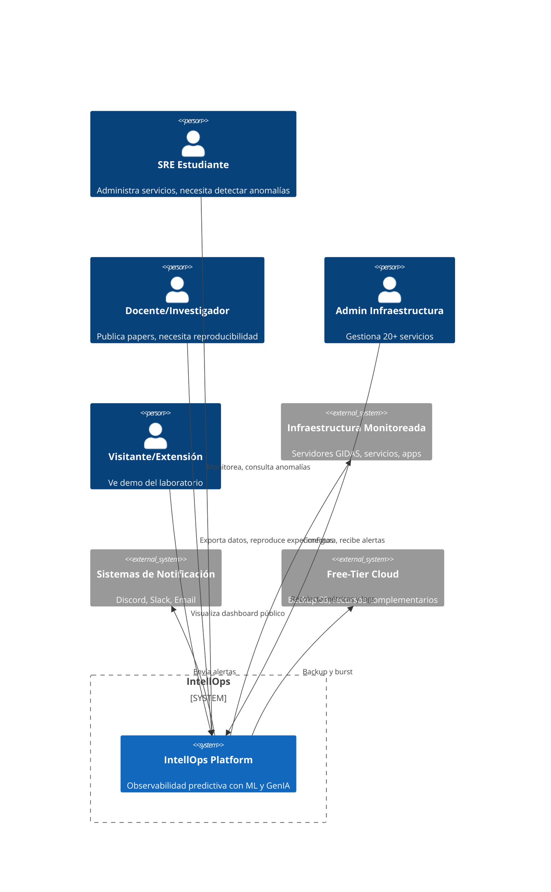

# Architecture Specification — IntellOps

- **Domain**: Arquitectura y Diseño de Sistemas
- **Estado**: Activo
- **Última actualización**: 2026-05-27
- **Autores**: Emanuel Rodriguez, Equipo InfraIT GIDAS

## 1. Visión General

IntellOps es un sistema de **observabilidad predictiva** diseñado bajo el paradigma de **monolito modular**, optimizado para recursos escasos (< 2GB RAM, CPU-only) y con una arquitectura **API-first, contract-driven**.

### 1.1. Principios Arquitectónicos

| Principio | Descripción | Implicancia |
|-----------|-------------|-------------|
| **Monolito Modular** | Código organizado en módulos con boundaries claros, deployado como una sola unidad | Menor complejidad operativa, sin latencia de red entre módulos, fácil de entender |
| **API-First** | Las APIs se diseñan antes que la implementación, con contratos versionados | Permite desarrollo paralelo, testing temprano, y documentación automática |
| **Contract-Driven** | OpenAPI 3.1 + AsyncAPI 3.0 como fuente de verdad para integraciones | Validación automática en CI, evita breaking changes no detectados |
| **Recursos Escasos First** | Cada decisión técnica prioriza el mínimo consumo de recursos | SQLite > TimescaleDB, Llama 1B > 8B, React static > SSR |
| **Evolucionabilidad** | Diseño que permite migrar a stacks más potentes sin reescribir | SQLite migrable a TimescaleDB, Static React migrable a SSR |
| **Observable por Diseño** | El sistema se auto-monitorea con Netdata | Métricas de salud del propio IntellOps |

### 1.2. Diagrama C4 — Contexto (Nivel 1)

### 1.3. Stakeholders

| Stakeholder | Interés | Preocupación Arquitectónica |
|-------------|---------|---------------------------|
| SRE Estudiante | Detectar anomalías rápido | Usabilidad, latencia de detección |
| Docente/Investigador | Reproducibilidad, datos exportables | Portabilidad, trazabilidad |
| Admin Infraestructura | Visibilidad unificada, alertas efectivas | Confiabilidad, mantenibilidad |
| Visitante/Extensión | Demo funcional, sin acceso interno | Seguridad, aislamiento |
| Coordinador | Progreso del proyecto, métricas | Mantenibilidad, extensibilidad |
| Director GIDAS | Publicaciones, transferencia | Reproducibilidad, apertura |

## 2. Decisiones Arquitectónicas Clave

| Decisión | Opción Elegida | Alternativa Descartada | Fundamento |
|----------|---------------|----------------------|------------|
| Estilo arquitectónico | Monolito modular | Microservicios | < 2GB RAM, equipo pequeño, sin necesidad de escalado independiente |
| Base de datos | SQLite con time-index | TimescaleDB, MongoDB | Zero config, zero RAM adicional, migrable |
| Framework backend | FastAPI | Django, Flask, Go | Async nativo, auto-docs OpenAPI, familiaridad del equipo |
| LLM | Llama 3.2 1B GGUF 4-bit | GPT-4 API, Llama 8B | Costo $0, privacidad, funciona en CPU |
| Dashboard | React static build | Next.js, Angular | Sin SSR, < 1MB bundle, hosting estático |
| Logs | Grafana + Loki | ELK Stack | Ver ADR-0001 |
| CI/CD | GitHub Actions | GitLab CI, Jenkins | Free para repos públicos, integración nativa |
| Contenedores | Docker Compose | Kubernetes | Single-node, setup < 30 min |

## 3. Documentos de Arquitectura

| Documento | Propósito | Formato |
|-----------|-----------|---------|
| `spec.md` | Esta especificación — overview, principios, C4 context | Spec |
| `containers.md` | Diagrama C4 de contenedores + decisiones tecnológicas | Spec |
| `components.md` | Diseño de componentes internos | Spec |
| `quality-attributes.md` | Escenarios de atributos de calidad (ISO 25010) | Spec |
| `constraints.md` | Restricciones arquitectónicas y principios de diseño | Spec |
| `interfaces.md` | Índice de contratos de API | Spec |
| `../../docs/adr/*.md` | Architecture Decision Records | ADR |
